# TwitterApp

### 1. Description
This project is made using Java Spring as back-end technology and the Angular framework (version 5) as front-end
technology. Autoconfiguration is used in the back-end, also known as annotation-based configuration.
Bootstrap is used on the front-end so the site could be responsive. Some of the components in the front-end are used from the external library
[ng-bootstrap](https://ng-bootstrap.github.io/#/components/accordion/examples), such as: modal window, pagination,
rating, tabs, typeahead. Models used in this project are: User, Tweet and TweetLike.
Taking about the authenticated user, it is taken care of at the front-end,
so the client provides the authenticated user ID in our application (in the client we keep in HTML5's local storage).
### 2. Architecture
#### 2.1. Back-end
The architecture is layered, meaning at the very top there is the presentation layer, consisted of Controllers, 
packaged in `web`. Next are services which handle the business logic (connecting models' data with controllers). At the very bottom is the persistence layer where the data is handled.
For the data storage is used the H2 in-memory database (the Java SQL database) which comes with Spring.
#### 2.2. Front-end
In the Angular client, there are the models with the same attributes as in the back-end so they can be appropriately mapped automatically.
Services are at the same level, and components are grouped in separate directories each.
### 3. Features
1. The starting screen is the Login screen with the focus positioned on the email field. By clicking enter on the keyboard, user will invoke the *Login* button.
If one of the data is not entered, the *Login* button is disabled.
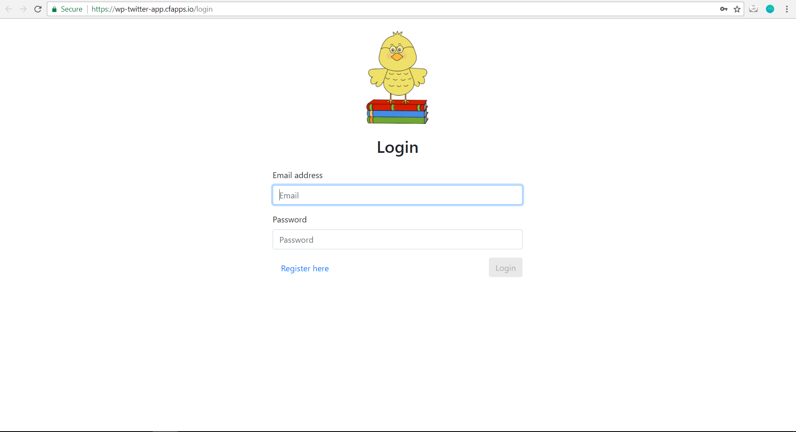
2. If the user tries to login without registering previously, or enters wrong credentials, an alert will appear.

3. First what user would do is Register. Autofocus is set on the first field, so the user doesn't need to use the mouse.
By clicking enter on the keyboard, user will invoke the *Register* button. The date is the default HTML input field of type date.
Both fields *Reset* and *Register* are disabled if nothing is entered, *Reset* will become enabled if at least one field is filled in.
*Register* will be enabled only if all the fields are filled in.
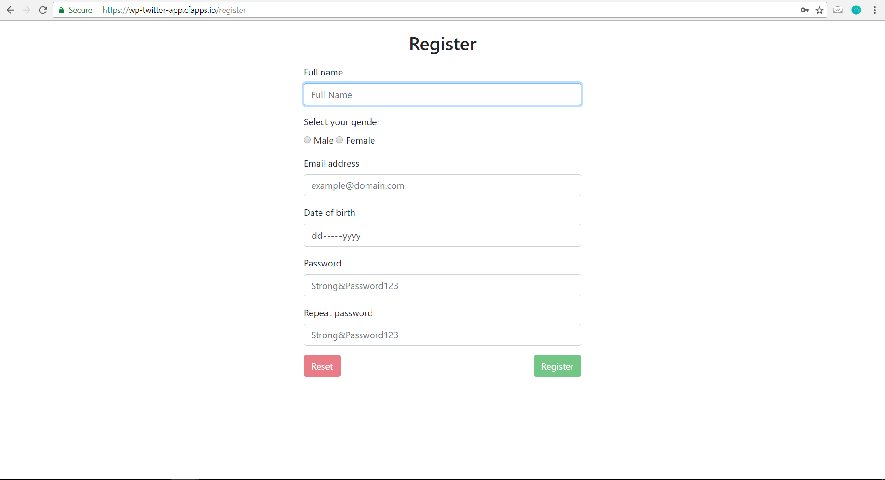
4. Form Validation - If some of the fields are not filled in correctly or not filled at all, an alert message will show below it. If the password fields don't match, a warning will be shown.
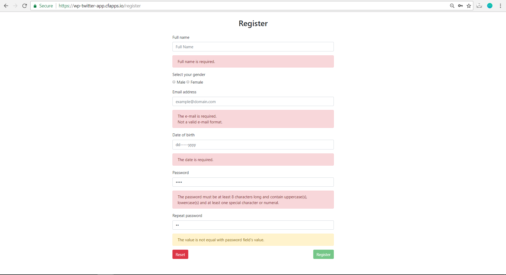
5. Registering looks okay also from a mobile screen, because of using Bootstrap.
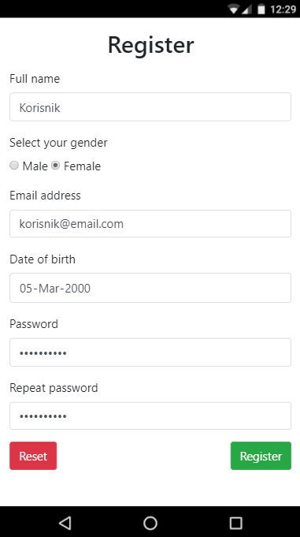
6. Now if some user (another or the same one) tries to register with the same email, an alert will appear, because emails must be unique, and only one user is allowed per email.
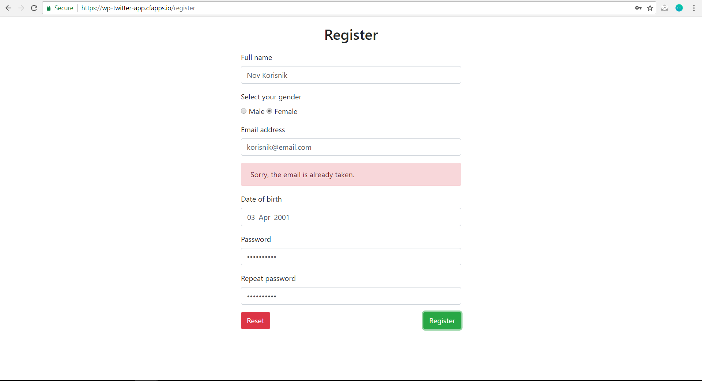
7. When user enters their credentials successfully, homepage comes up. This is the initial look where anyone hasn't published anything yet.
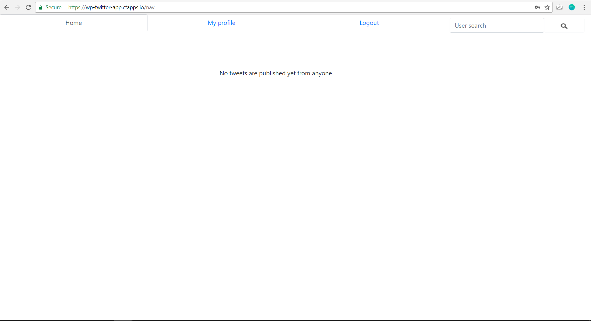
8. Profile page - User can view their own profile by clicking *My profile* in the navigation bar.
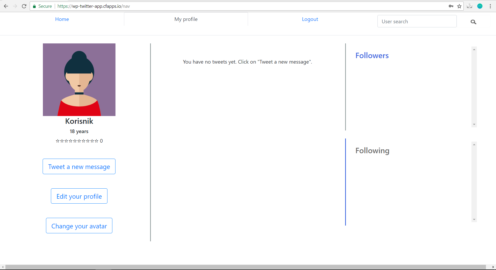
9. When user clicks *Tweet a new message* a modal window will appear with autofocus on the blank area. Initially blank, the *Publish* button is disabled when nothing or whitespaces are entered.
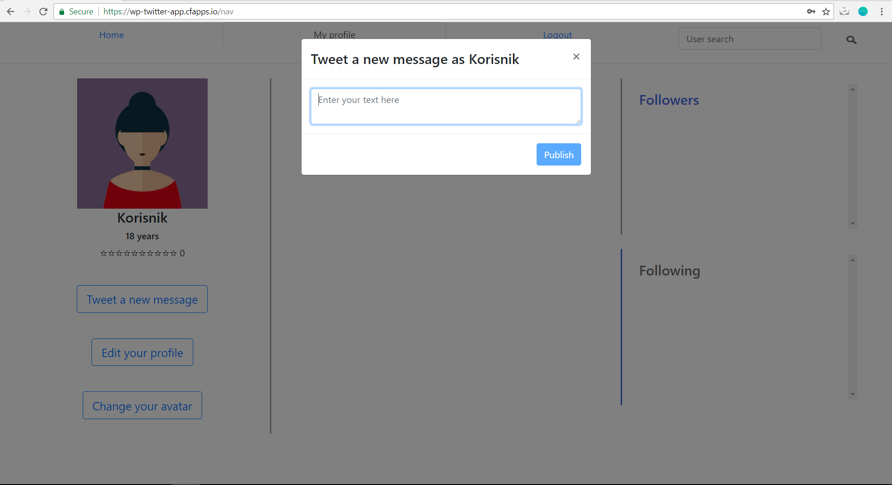
10. Publish tweet - the idea is as the user clicks *Publish* the modal window disappears and the written tweet now becomes part of the profile page, on the top.

11. Tweets are listed according to the time period they were published, in descending order.
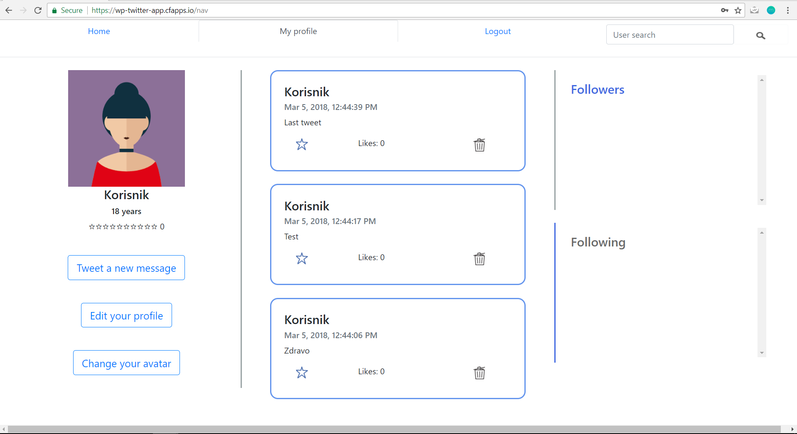
12. Delete tweet by clicking on the bin icon. A modal window arises asking if the user is sure to delete the tweet.
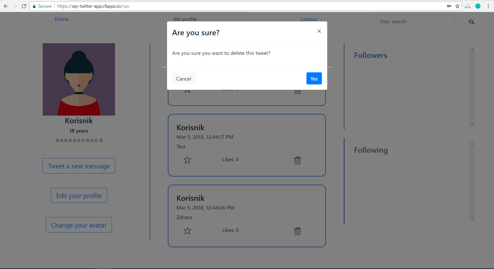
13. Edit profile - click on *Edit your profile* and edit the information. This is the initial window.
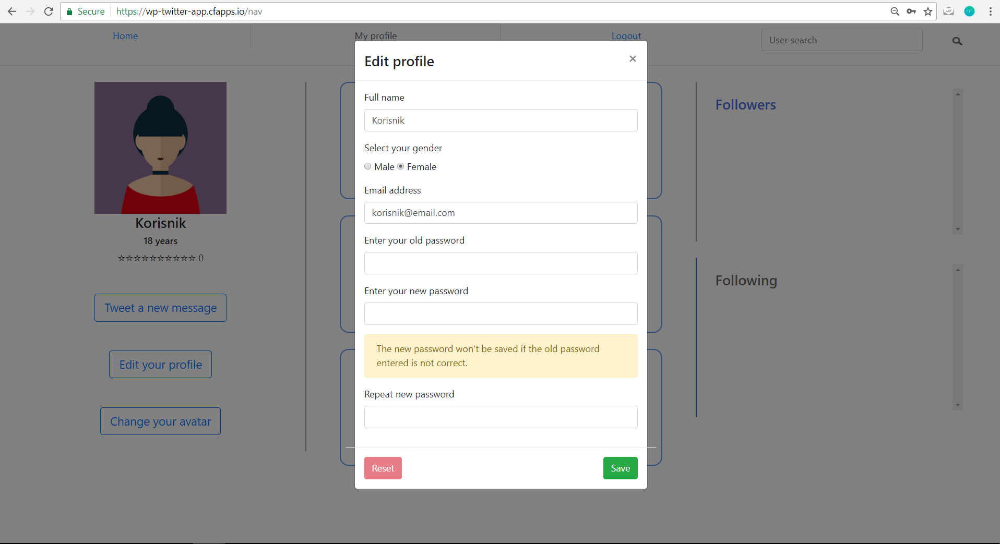
14. The validation form on edit profile is the same as the validation form on */register*.
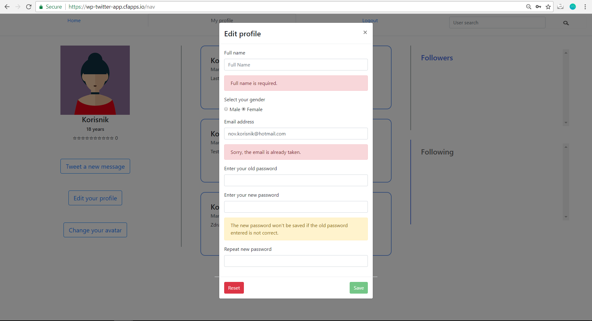
15. Change avatar - by clicking on *Change avatar*. When nothing is uploaded, the button *Upload* is disabled.
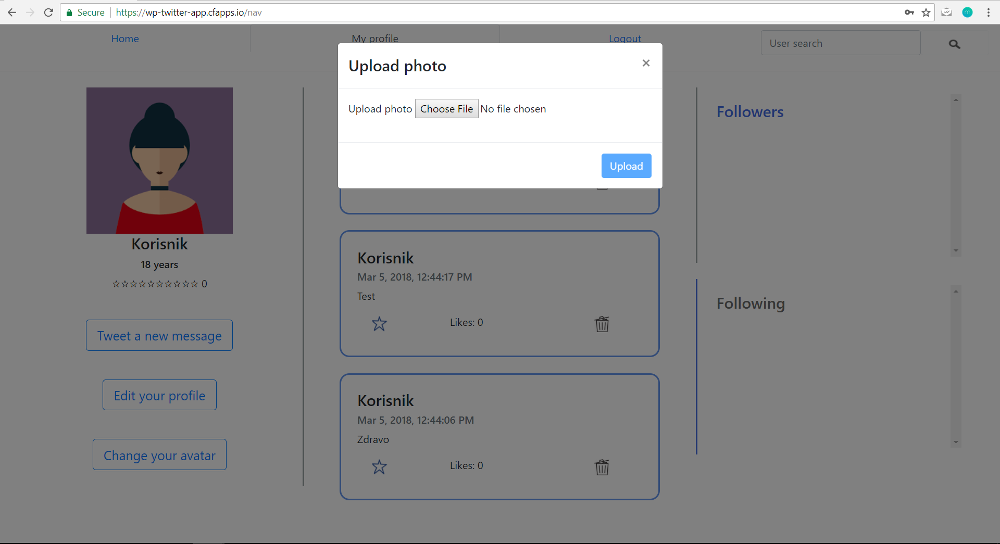
16. The photo to be uploaded is limited on 3MB and if the user tries to upload larger photo an alert will appear, and the button *Upload* will still is disabled.

17. The following situation is okay and now the photo is going to be saved as base64.

18. The changes, like editing profile information, uploading avatar, or deleting a tweet, are taking place immediately. This is how the profile looks with the changes made so far.
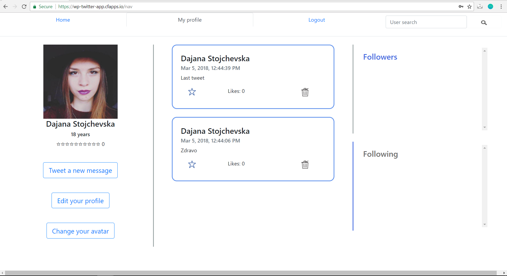
19. Users can search for other users' unique usernames (here emails are taken as username) so by writing more 
than two letters, a list of suggestion appears. They can select one of them and by clicking enter on the 
keyboard or on the search icon they will be taken to selected user's public profile.
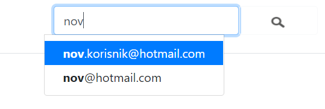
20. If nothing is selected and the user writes something that cannot be found, an error message will appear.

21. Now will logout from this user and login as one of the others. This is how other users' public profile looks like.
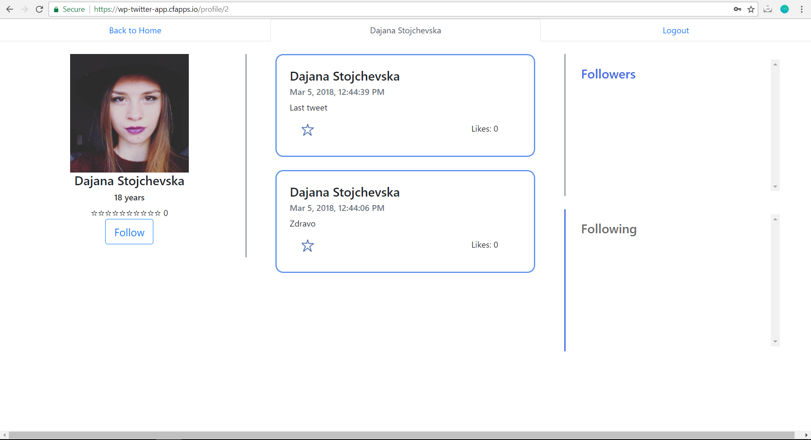
22. Like a tweet by clicking on the star, now it will become filled and the number of likes raises up. If the user clicks on the star again it returns in its initial form as empty and the like would be removed. 

23. The user can set a rating to the user and can follow them, meaning this user's tweets will be listed on the homepage.
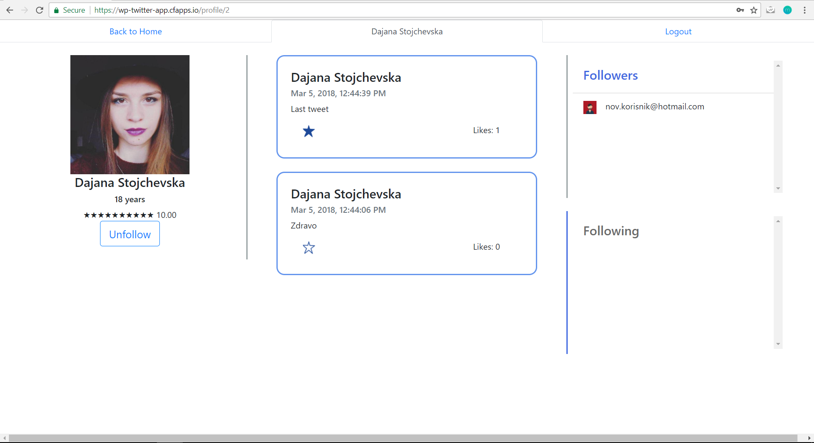
24. By clicking *Back to home* from the Navigation bar, the user will return to the starting view. If there are more than 4 tweets, *Pagination* will appear, max 4 tweets per page.
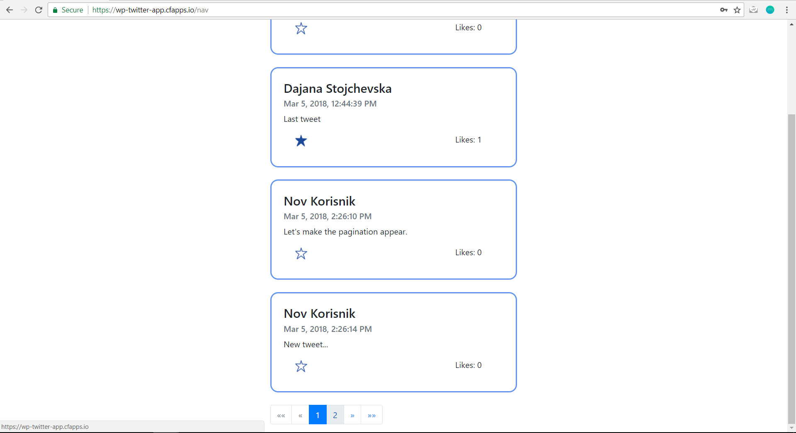
25. If the first user logs in again and check their profile, they are going to see that they have a follower, tweet like and rating.

26. If the user now visits the other user's profile, and follows them back, now on his own profile he is going to have both follower and following.
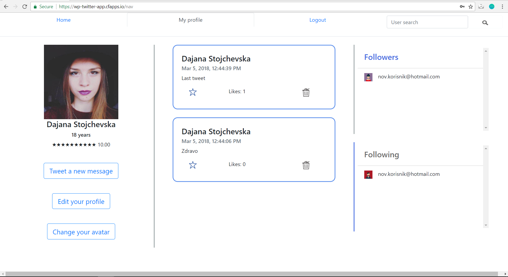
27. Looked from mobile, the three parts of the profile will go one under another. Same is with public profile.

28. The home page from mobile looks similar like from the web, tweets are in the middle. Same is with login page.

29. User can logout after which is redirected on */login* screen.
30. If user is not logged in they are forbidden to go to */nav* or visit other users' public profiles. If they try visiting a forbidden page, the */login* screen will be displayed.
